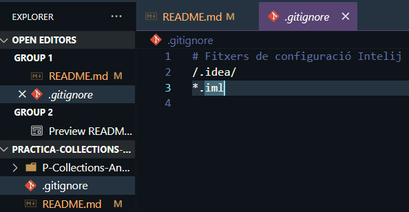
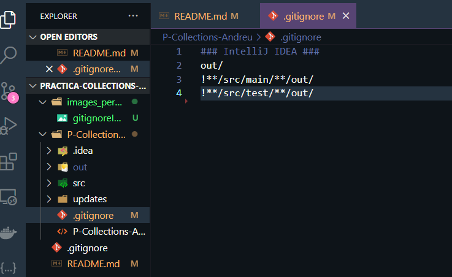

# Introducció.

La següent pràctica tracta de crear un **mercat online**, on es poden **comprar productes d'alimentació, electrònica i tèxtils**. El programa té un menú principal on tens 4 possibles opcions:

     1. Intorduir producte.
     2. Passar per caixa.
     3. Mostrar el que tenim a la cistella.
     4. Omplir el carretó de productes random
     5. Mostra preu carret.
     6. Sortir

**Informació general del programa.**

- El programa ens dóna els bons dies, la bona tarda o la bona nit depenent de l'hora que sigui.
- Introduir producte ens permet afegir un producte d'una de les categories dites anteriorment.
- Passar per caixa ens ensenya el rebut, per posteriorment pagar. També ens dóna l'opció d'escollir si en volem còpia o no.
- Mostrar carretó ens mostra els productes que tenim afegits al carretó.
- Omplir carretó, ens permet omplir el carretó amb objectes random (per facilitar la feina al professor). PD: Els preus no van a cord amb el producte, hi pot haver un pa de 70€.
- Mostrar preu carretó, ens informa del preu que tenim actualment al carretó, per no passar-nos i que després no puguem pagar.
- La darrera opció és sortir.

Important:
     - El carretó no pot superar els 100 productes.
     - La longitud d'un nom no pot superar els 15 caràcters.
     - Els productes amb un codi de barres igual que algun del fitxer updates, s'actualitzarà. Això ho tenim per si tenim dies amb ofertes per exemple un black friday.

## .gitignore

- He fet un .gitignore per no pujar al repositori els fitxers que crea el IDE (fitxers .iml).
- El propi java incorpora un .gitignore per no pujar res del out.

**gitignore general, per excloure els fitxers IML**


**gitignore dintre del projecte per excloure el out**


## Classe abstracte 'Producte'

- La classe és abstracta per no poder crear productes amb la classe 'Producte', només en podrem crear subclasses de la mateixa.

- Podrem modificar (setters) tot excepte el codi de barres, per això el posem com a variable constant ja que no variarà. En el meu cas, crec que codi de barres sempre serà el mateix.

- Totes les variables tindran els seus getters, ja que els necesitem.

- **Important: he fet la variable 'quantitat' que s'anirà actualitzant a mesura que anem afegint productes amb el mateix codi de barres**

- 'Calcular preu' -> Mètode abstracte perquè sigui obligatori anomenar-lo a les seves subclasses.

## Subclasse de Producte 'Alimentació'

- Demanem la data en format dd-mm-yyyy (String).

- 'calcularPreu()' -> Calculem el preu segons la data de caducitat. 
    1. Guardem la data actual.
    2. Convertim la data de caducitat de String a LocalDate amb format(dd-MM-yyy) per poder operar amb ella.
    3. Fem l'operació que ens diu l'enunciat, pero en compte de 'preu - preu*(1/(dataCaducitat-dataActual+1)) **Aquí va una suma en comptes de una resta perquè no cuadren els resultats** (preu*0.1)'.

- El getter de preu serà el resultat del mètode 'calcularPreu()'.

- No tenim cap setter, ja que el preu que es té que poder modificar és el de la classe pare 'Producte' que es el preu base, aquí es necessita el preu fent el càlcul. La data de caducitat tampoc ha de poder cambiarse, no te sentit que es pugui modificar. La fem com ha variable constant.

**calcularpreu()**

  ````java
   // Sobreescrivim el mètode obstracte de Producte
  // Sobreescrivim el mètode obstracte de Producte
    @Override
    public float calcularPreu() {
        // Obtenim la data actual 
        LocalDate dataActual = LocalDate.now();

        // Guardem la DATACADUCITAT en format LocalDate i la parsegem al format dd-mm-yyyy.
        LocalDate dataParsejada = LocalDate.parse(DATACADUCITAT, DateTimeFormatter.ofPattern("dd-MM-yyyy"));
        // Operació de l'enunciat
        int resta = dataActual.until(dataParsejada).getDays() +1;
        float preuFinal = super.getPreu() - super.getPreu() * (1.0f / resta) + (super.getPreu() * 0.1f);
        return preuFinal;

        @Override
        public float getPreu() {
            return calcularPreu();
        }
    }
  ````

  - Ordenem per nom amb l'interface comarable.
  
  ````java
    @Override
    public int compareTo(Alimentacio a1) {
        return this.getNom().compareTo(a1.getNom());
    }
  ````

## Suclasse de Producte 'Textil'
 
- La variable composicioTextil serà un enum, podria ser perfectament una String, però per fer algo diferent.

````java 
// Enum de composició tèxtil
public enum enumCompositioTextil {COTO, POLIESTER, LLI, SEDA, LLANA, NILO;};
    enumCompositioTextil composicioTextil;
````

- Sobreescrivim el mètode calcularpreu(), però deixiem els valors de la classe super (Producte) perquè no varia en aquest cas.
  
````java
   // Sobreescrivim el mètode abstracte de Producte i el deixem igual, no varia de la classe superior
    @Override
    public float calcularPreu() {
        return super.getPreu();
    }

    @Override
    public float getPreu() {
        return calcularPreu();
    }

````
- Composició tèxtil tindrà el seu setter per poder cambiarla.

- Orndenem els productes per composició textil, per aixo farem servir l'interface compareTo().
  ````java
   @Override
    public int compareTo(Textil t1) {
        // String ja implementa l'interface compareTo i la fem servir.
        return this.getComposicioTextil().compareTo(t1.getComposicioTextil());
    }
  ````
    
## Suclasse de Producte 'Electronica'

- En aquest cas data de garantia si que es podrá modificar. Perquè es posible que al producte li retallin la vida de garantia o extendre-la.

- Sobreescrivim el mètode calcularpreu() i fem l'operacio de l'enunciat. El preu d'aquest tipus de producte varia en funció dels dies que té de garantia.

````java

    // Sobreescrivim el mètode abstracte de Producte i fem l'operacio de l'enunciat
    @Override
    public float calcularPreu() {
        // Fem l'operació de l'enunciat
        float operacioGarantia = super.getPreu() + super.getPreu()*(diesGarantia/365)*0.1f;
        return operacioGarantia;
    }

    @Override
    public float getPreu() {
        return calcularPreu();
    }  
````

- Ordenem els productes de electronica per nom amb l'inteface comparable.
  
  ````java
      @Override
    public int compareTo(Electronica e1) {
        return this.getNom().compareTo(e1.getNom());
    }
  ````
  
## Classe CarroCompra

- Classe important on definirem tots els mètodes i funcions amb els quals omplirem el main, de forma que en el main només tinguem les opcions a escollir.

- **En aquest context no necessitem operacions específiques de LinkedList, com ara la inserció o eliminació enmig de la llista, i atès que accedirem als elements de manera seqüencial, ArrayList sembla l'opció més adequada. A més, ArrayList ofereix un accés més ràpid als elements mitjançant índexs.**
  
### **<u>Variables</u>**

- Llista on tindrem l'informació de tots els productes.

````java
        // Llista de productes
    protected static ArrayList<Producte> llistaProductes;
````

- Llista de productes en la que no farem cas a la quantitat i afegirem tots els productes com a independents, així podem veure la mesura de la llista i si ja té 100 productes afegits. De no fer aquesta copia, no calcularà bé si tenim 100 productes, o hariem de fer un for amb la llista de productes principal i calcular la quantitat. És més eficient fer un arraylist ja que 100 productes no son masses.

````java
        // Llista de productes de control
    protected static ArrayList<Producte> llistaProductesCopia;
````

- Tindrem una variable per controlar el limit de productes de una manera més intuitiva.

````java
    // Variable constant que limita el nombre de productes
    static int LIMIT_PRODUCTES = 100;
````

- Hashmap per controlar que no hi hagin téxtils amb el mateix codi de barres. Es controla més ràpid així que fent un for a la llista general.

````java
    // Diccionari que ferem servir per veure si tenim més de dos productes textils amb el mateix codi de barres
    private HashMap<String, Integer> mapTextilsDuplicats;
````


- Hasmap que farem servir per crear codis de barres automàticament, més endevant ho veiem.
  
````java
  //Diccionari que farem servir per crear un codi de barres aleatori
    protected static HashMap<String, String> nomYCodigsProductes;
    private static Random random;
````

- Hasmap per veure si ja em introduit previament un producte i després sumar 1 a la quantitat del producte. Amb aquest hasmap evitem fer treballar més de la compta a la màquina, perquè evitem estar fent un for per a cada producte, aixì solament fem el for si el producte ja existeix.

````java
   // Diccionari que ferem servir per veure si tenim més de dos productes de la mateixa categoria amb el mateix codi de barres
    protected static HashMap<String, Integer> mapProductesJaIntroduits;
````

### **<u> Métodes </u>**

**Bloc 1**

saludar() -> L'aplicació ens saludarà en funció de l'hora que sigui.  
    
    1. La aplicació ens dirà 'bon dia', 'bona tarda' o 'bonanit' en funció de l'hora que sigui.
    2. La formula es la seguent: (Si es després de les 06:00h i abans de les 14:00h) direm bon dia, (si es després de les 14:00h abans de les 20.00h) direm bona tarda y (si es després de les 20:00h i abans de les 06:00) direm bona nit. 

menu1() -> Ens saluda i ens mostre les opcions que podem escollir.

**Bloc 2**
   
generarCodiDeBarres(String nom) -> Mètode per crear aleatoriament el codi de barres fent servir el hasmap nomYCodigsProductes.
    - Li passem un nom i segons el nom ens farà un número random de 3 xifres.
    - Format del codi: nom-3digits.
    - *Si el nom ja existeix, li dona el mateix codi de barres*

Comprovació a l'hora de crear un producte.
````java
            // Comprovem si el nom ja ha sortit previament.
            // Si no ha sortit generem un codi de barres.
            // Si ja ha sortit, agafim el codi de barres ja generat previament per aquest nom.
            if (nomYCodigsProductes.containsKey(nom)) {
                codiDeBarres = nomYCodigsProductes.get(nom);
            } else {
                codiDeBarres= generarCodiDeBarres(nom);
                nomYCodigsProductes.put(nom, codiDeBarres);
            }
````

**Bloc 3**
Mètodes per controlar entrada d'usuari

comprovarDataCaducitat -> Regex per controlar que sigui una data a partir de 2024.

dataCaducitatEsMenorQueDataActual -> Torna true si es menor que la data actual, per lo tant està malament introduida.

comprovarPreuTextil -> Li pasem un producte i mirem si el codi de barres coincideix amb el de l'arxiu updates, si coicideix, actualitzarem el preu base.


**Bloc 4**
escollirProducte -> Creació de producte.
      1. Comprovem que la llista de productes (copia) no estigui plena, si no llancem una excepció i escribim el log.
      2. Fem un menú per demanar la categoria que vol introduir.
      3. Controlem que la entrada sigui un enter, si no escribim el log i llencem una excepció.
      4. Fem un altre control d'errors, aquest cop si l'usuari ha introduit un enter, però no està dintre del rang que toca, tornarem a demanar-li que l'introdueixi de nou.
      5. Controlem que el nom introduit sigui igual o més petit de 15, si no llancem una excepció + log.
      6. Controlem que l'usuari entri un float en el preu, si no llancem excepció + log.
      7. Controlem que l'usuari introdueixi un preu positiu, si no excepció + log.
      8. Creem el codi de barres de la manera que em explicat abans.
      9. **Creació de productes d'Alimentació.**
      10. Demanem la data de caducitat i li fem els controls d'errors, si no està bé introduida, llancem excepció + log.
      11. **Creació de productes d'Electronica.**
      12. Demanem els dies de garantia, si no es un enter, o es negatiu, llencem excepció + log.
      13. **Creació de productes de Textil.**
      14. Demanem composicióTextil i la pasem a mayuscula perquè aixií coincideixi amb la descripció de l'enum.
      15. Comprovem a una llista de composicions si es correcta l'entrada, si no llencem excepció + log.
      16. Cridem a la funció afegir product. 
      17. Informem de que s'ha creat amb exit.
  

afegirProducte(Alimentacio Producte) -> Mètode per afegir productes a la llista de productes o pujarli la quantitat a +1. També tenim el 
      1. Controlem que no hi hagin textils amb el mateix codi de barres.
      2. Comprovem que no hi hagin codis de barres repetits amb el hashmap, d'aquesta forma evitem estar fent constantment un for, i fem treballar al hashmap que es mes rapid i optim. Si hi ha algun codi de barres repetit, augmentem la quantitat del producte en 1, pero no l'afegim a la llista de productes.
      3. Si o si l'afegim a llista de productes copia, per controlar la mida.

**Bloc 5**

estilMostrarProducte -> Fem un un estil mode ticket de compra. 

mostrarProducte() -> Mètode per mostrar el contingut de carro sense preu, nomès categoria, nom i quantitat.
    1. Ordenem la llista per la nom.
    2. Fem centineles atomic per poder treballar amb lamda expresion
    3. Aquest centineles serveixen perquè sempre entraran dintre de la primera condició en la qual farem un stringformat per mostrar la classe i després tot el contingut, es posarà la variable com a false i ja no tornarà a imprimir més la clase. String format seveix per fer maca la frase.
    4. Fem els bucles de cada classe amb l'estetica i la llogica que s'explico als comentaris.

**Bloc 6**

estilTicket -> Estil amb string format que simula un ticket.
   
generarTicketDeCompra() -> Ticket de compra.
    1. Preguntem si vol copia.
    2. En el cas de voler copia, comprovem si existeix ja l'arxiu i el borrem per no generar un append. Imprimim l'estetica del ticket.
    3. Cridem a l'estil el ticket
    4.  Ordenem la llista.
    5.  Creem un formater de decimals per que tots tinguin 2 decimals.
    6.  Els mateixos centineles que a mostrarCarretCompra, de fet es molt semblant.
    7.  Fem un integer que vagi sumant 1, serà el número de producte.
    8.  Un float per el preu total.
    9.  Un boolea de copia ticket per veure si fa falta copia o no.
    10. Mateixa metodologia que a mostrarCarro, però amb la diferencia de que primer comprovem si vol copia, en cas de que si fem exactament el mateix que fariem, pero afegtint l'imprimació.
    11. Després calculem el preuTotal, expico més detalladament als comentaris del codi.
    12. Per als 3 for es el mateix.
    13. Fem 68 guions que son els espais totals del String format, així queda tot nivellat.
    14. En cas de voler copia imprimim els guions i el preu total. També el mostem per consola.
    15. En cas de no voler copia només mostem els guions i el preu total.

calcularPreuTotal -> Preu * quantitat.

mostrarPreuTotal -> Fem un recorregut de la llista i mostrem el preu total.

escriureLog -> Passem el missatge i el sobreescrivim al l'arxiu de logs. Si no existeix, el creem nosaltres.

imprimirCopia -> Lo mateix que al de escriureLog, pero en un altre fitxer. Anem passant missatges i els anem escrivint amb el format que li donem amb String format.


## Classe OmplirCarretAutomaticament

Classe per omplir el carret automaticament.
- Tenim les llistes aleatories.
- Tenim mètodes per agafar aleatoriament noms dels productes i composicions dels textils.
- Convertim la seva mida en un int i agafem un numero random entre 0 i la mida. D'aquesta manera tenim un producte aleatori de la llista.
- Creem els productes aleatoris.

## Classe Main.
Creem un carro i fem la crida de totes les funcions anteriors.
  
